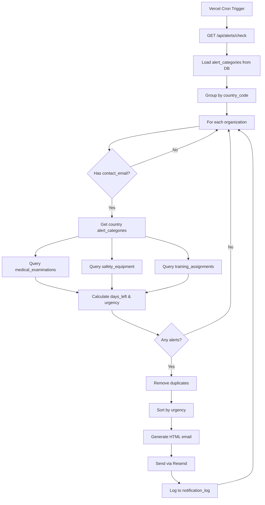

# Alert System Documentation

**Platformă:** s-s-m.ro — Multi-Tenant SSM/PSI Platform
**Data:** 13 Februarie 2026
**Versiune:** 2.0 (Dynamic Multi-Country)

---

## Table of Contents

1. [Overview](#overview)
2. [Alert Types & Categories](#alert-types--categories)
3. [Severity Levels](#severity-levels)
4. [Generation Logic](#generation-logic)
5. [Notification Channels](#notification-channels)
6. [Configuration Per Organization](#configuration-per-organization)
7. [Escalation Rules](#escalation-rules)
8. [Digest vs Immediate Notifications](#digest-vs-immediate-notifications)
9. [Database Schema](#database-schema)
10. [API Endpoints](#api-endpoints)
11. [Country-Specific Configuration](#country-specific-configuration)
12. [Implementation Examples](#implementation-examples)

---

## Overview

The s-s-m.ro Alert System is a **multi-channel notification engine** designed to monitor compliance obligations and send timely alerts across **email, push notifications, SMS, and WhatsApp**.

### Key Features

- **Dynamic Multi-Country Support**: Alert thresholds and categories are configurable per country (RO, BG, HU, DE, PL)
- **Multi-Channel Delivery**: Email (Resend), Push, SMS (Twilio), WhatsApp (Twilio)
- **Smart Escalation**: Automatic escalation based on days overdue and priority levels
- **Digest & Immediate Modes**: Batch alerts weekly or send immediately for critical items
- **Rate Limiting**: Per-channel rate limits with cooldown periods
- **Retry Logic**: Exponential backoff with fallback channels
- **Quiet Hours**: Do Not Disturb mode with urgent alert exceptions
- **Deduplication**: Prevent duplicate alerts within configurable time windows
- **Audit Trail**: Full notification log in `notification_log` table

---

## Alert Types & Categories

### Core Alert Categories

Alerts are stored in the **`alert_categories`** table and configured **per country**. Each category defines:

| Alert Category | Description | Default Thresholds | Priority |
|----------------|-------------|-------------------|----------|
| `medical_exam_expiry` | Control medical (fișă medicină muncii) expiring | 30d / 15d / 7d | warning → critical → urgent |
| `training_expiry` | SSM/PSI training courses expiring | 30d / 15d / 7d | warning → critical → urgent |
| `equipment_inspection` | Fire safety equipment inspection due | 30d / 15d / 7d | warning → critical → urgent |
| `document_expiry` | Legal documents expiring (licenses, permits) | 30d / 15d / 7d | warning → critical → urgent |
| `compliance_score` | Organization compliance score below threshold | Score < 75% | critical |
| `legislation_update` | New legal acts or regulatory changes | N/A | info |
| `custom` | Custom rules defined by organization | Variable | Variable |

### Notification Types (Database Enum)

```typescript
type NotificationType =
  | 'alert_mm_30d'      // Medical 30 days
  | 'alert_mm_15d'      // Medical 15 days
  | 'alert_mm_7d'       // Medical 7 days
  | 'alert_mm_expired'  // Medical expired
  | 'alert_psi_30d'     // Equipment 30 days
  | 'alert_psi_15d'     // Equipment 15 days
  | 'alert_psi_expired' // Equipment expired
  | 'report_monthly'    // Monthly compliance report
  | 'fraud_alert'       // Suspicious activity detected
  | 'system_alert'      // System maintenance or errors
```

---

## Severity Levels

### Alert Priority Enum

```typescript
type AlertPriority = 'info' | 'warning' | 'critical' | 'urgent'
```

### Priority Calculation Logic

Priority is determined by **days until expiry** and **alert category thresholds**:

```typescript
function calculateAlertUrgency(
  daysLeft: number,
  alertCategory: AlertCategory
): AlertPriority {
  if (daysLeft < 0) return 'urgent' // Already expired
  if (daysLeft <= alertCategory.critical_days_before) return 'critical'
  if (daysLeft <= alertCategory.warning_days_before) return 'warning'
  return 'info'
}
```

### Visual Indicators

| Priority | Emoji | Color | Badge Text |
|----------|-------|-------|-----------|
| `urgent` | 🔴 | `#DC2626` (red-600) | EXPIRAT / URGENT |
| `critical` | 🟠 | `#F57C00` (orange-600) | CRITIC - X zile |
| `warning` | 🟡 | `#D97706` (yellow-600) | ATENȚIE - X zile |
| `info` | 🔵 | `#2563EB` (blue-600) | Informare - X zile |

---

## Generation Logic

### Cron Job Schedule

**Vercel Cron**: Daily at **08:00 Europe/Bucharest**

```json
{
  "crons": [
    {
      "path": "/api/alerts/check",
      "schedule": "0 8 * * *"
    }
  ]
}
```

### Check Process Flow



### Expiry Monitoring

The cron job checks the following tables:

1. **`medical_examinations`** — `expiry_date` column
2. **`safety_equipment`** — `expiry_date` column
3. **`training_assignments`** — `due_date` column (status: assigned/overdue)
4. **`documents`** — `expiry_date` column (if implemented)

**Query Logic:**

```sql
SELECT * FROM medical_examinations
WHERE organization_id = $1
  AND expiry_date <= (CURRENT_DATE + $max_warning_days)
ORDER BY expiry_date ASC;
```

Where `$max_warning_days` is the maximum `warning_days_before` from all alert categories for the organization's country.

---

## Notification Channels

### Supported Channels

| Channel | Provider | Status | Priority | Rate Limits |
|---------|----------|--------|----------|-------------|
| `email` | Resend (alerte@s-s-m.ro) | ✅ Active | 1 (highest) | 100/hour, 500/day |
| `push` | Web Push API | 🚧 Planned | 2 | 50/hour, 200/day |
| `sms` | Twilio | 🚧 Planned | 3 | 20/hour, 100/day |
| `whatsapp` | Twilio Business API | 🚧 Planned | 4 | 30/hour, 150/day |

### Channel Configuration

Each channel has its own configuration in the `AlertsModuleConfig`:

```typescript
interface ChannelConfig {
  channel: NotificationChannel
  isEnabled: boolean
  priority: number                     // 1 = highest, used for fallback order
  provider?: string                    // Ex: 'resend', 'twilio', 'vonage'
  rateLimits: {
    maxPerHour: number
    maxPerDay: number
    cooldownMinutes: number            // Minimum time between same alerts
  }
  retryPolicy: {
    maxRetries: number
    retryDelaySeconds: number[]        // Exponential backoff: [30, 60, 120, 300]
    fallbackChannel?: NotificationChannel  // Fallback if all retries fail
  }
  templates: {
    subject?: string                   // Email/SMS subject template
    body: string                       // Message body template
    variables: string[]                // Available template variables
  }
}
```

### Email Channel (Active)

**Provider:** Resend
**From Address:** `alerte@s-s-m.ro` (DKIM/SPF/DMARC configured)
**Subject Template:** `[SSM] {org.name} — ⚠️ {count} EXPIRATE!`

**HTML Template Features:**
- Responsive design (max-width: 700px)
- Color-coded sections by urgency
- Tables with employee/equipment details
- Days remaining badges
- Direct link to dashboard

**Rate Limits:**
- 100 emails/hour
- 500 emails/day
- 15 min cooldown between duplicate alerts

### Push Notifications (Planned)

**Implementation:** Service Workers + Web Push API
**Payload:**
```json
{
  "title": "{category}",
  "body": "{message}",
  "icon": "/icon-192.png",
  "badge": "/badge-72.png",
  "data": {
    "url": "{actionUrl}",
    "organization_id": "{org_id}",
    "alert_id": "{alert_id}"
  }
}
```

### SMS/WhatsApp (Planned)

**Provider:** Twilio
**Template (SMS):**
```
[{priority}] {category}: {message}.
Detalii: {actionUrl}
```

**Template (WhatsApp):**
```
🔔 *{category}*

{message}

{details}

👉 {actionUrl}
```

---

## Configuration Per Organization

### Organization Alert Preferences

Each organization can configure:

1. **Preferred Channels** — `organizations.preferred_channels` (JSONB array)
2. **Contact Email** — `organizations.contact_email` (primary recipient)
3. **Alert Frequency** — Immediate vs. Digest (default: weekly digest)
4. **Quiet Hours** — Optional DND schedule

### Alert Rules Per Organization

Organizations can define custom alert rules in `alertRules[]`:

```typescript
interface AlertRule {
  id: string
  name: string
  category: AlertCategory
  isActive: boolean
  priority: AlertPriority
  triggerConditions: {
    daysBeforeExpiry?: number          // Days before expiration
    complianceScoreBelow?: number      // Trigger if score below threshold
    customCondition?: string           // Custom SQL/logic condition
  }
  channels: NotificationChannel[]      // Channels to use for this rule
  recipients: {
    includeOrgAdmins: boolean          // Send to org admins
    includeConsultants: boolean        // Send to assigned consultants
    includeEmployees: boolean          // Send to affected employees
    customEmails: string[]             // Additional email addresses
    customPhones: string[]             // Additional phone numbers
  }
  escalation?: {
    enabled: boolean
    escalateAfterDays: number          // Days to wait before escalation
    escalatePriority: AlertPriority    // New priority after escalation
    escalateChannels: NotificationChannel[]
    escalateRecipients: string[]
  }
}
```

### Default Alert Rules (Romania)

```typescript
[
  {
    id: 'medical-exam-30d',
    name: 'Control medical expiră în 30 zile',
    category: 'medical_exam_expiry',
    isActive: true,
    priority: 'warning',
    triggerConditions: { daysBeforeExpiry: 30 },
    channels: ['email'],
    recipients: {
      includeOrgAdmins: true,
      includeConsultants: true,
      includeEmployees: false,
      customEmails: [], customPhones: []
    }
  },
  {
    id: 'medical-exam-7d',
    name: 'Control medical expiră în 7 zile',
    category: 'medical_exam_expiry',
    isActive: true,
    priority: 'urgent',
    triggerConditions: { daysBeforeExpiry: 7 },
    channels: ['email', 'push', 'sms'],
    recipients: {
      includeOrgAdmins: true,
      includeConsultants: true,
      includeEmployees: true,
      customEmails: [], customPhones: []
    },
    escalation: {
      enabled: true,
      escalateAfterDays: 3,
      escalatePriority: 'urgent',
      escalateChannels: ['sms', 'whatsapp'],
      escalateRecipients: []
    }
  }
]
```

---

## Escalation Rules

### Auto-Escalation Levels

Escalation occurs **automatically** when an item remains unresolved past its threshold:

| Level | After Days Overdue | Priority | Additional Channels | Notify Management |
|-------|-------------------|----------|-------------------|------------------|
| **1** | 7 days | `critical` | + push | ❌ No |
| **2** | 14 days | `urgent` | + push, sms | ✅ Yes |
| **3** | 21 days | `urgent` | + push, sms, whatsapp | ✅ Yes |

### Escalation Logic

```typescript
interface EscalationRules {
  enableAutoEscalation: boolean
  escalationLevels: {
    level: number                    // 1, 2, 3
    afterDays: number                // Days overdue before this level
    priority: AlertPriority
    additionalChannels: NotificationChannel[]
    notifyManagement: boolean        // Escalate to upper management
  }[]
}
```

### Example Escalation Flow

1. **Day 0**: Medical exam expires → `urgent` alert via email
2. **Day +7**: Still not resolved → Escalate to Level 1: + push notification
3. **Day +14**: Still not resolved → Escalate to Level 2: + SMS + notify org management
4. **Day +21**: Still not resolved → Escalate to Level 3: + WhatsApp + notify consultant

---

## Digest vs Immediate Notifications

### Digest Mode (Default)

**Schedule:** Weekly on **Monday at 08:00**

**Configuration:**

```typescript
interface DigestConfig {
  enabled: boolean
  frequency: 'daily' | 'weekly' | 'biweekly' | 'monthly'
  dayOfWeek?: number                   // 0-6 for weekly/biweekly (0 = Sunday)
  dayOfMonth?: number                  // 1-31 for monthly
  time: string                         // HH:MM format (24h)
  timezone: string                     // Ex: 'Europe/Bucharest'
  channels: NotificationChannel[]
  includeCategories: AlertCategory[]
  minPriority: AlertPriority           // Minimum priority to include
  groupBy: 'category' | 'priority' | 'organization'
  maxItemsPerDigest: number
}
```

**Default Digest Settings (Romania):**

```typescript
{
  enabled: true,
  frequency: 'weekly',
  dayOfWeek: 1, // Monday
  time: '08:00',
  timezone: 'Europe/Bucharest',
  channels: ['email'],
  includeCategories: [
    'medical_exam_expiry',
    'training_expiry',
    'equipment_inspection',
    'document_expiry',
  ],
  minPriority: 'info',
  groupBy: 'category',
  maxItemsPerDigest: 50
}
```

**Email Structure:**

```
Subject: 📊 Raport Săptămânal SSM — [Org Name]

Body:
┌─────────────────────────────────────┐
│ 🔴 EXPIRATE (5 items)              │
│ 🟠 CRITICE (12 items)              │
│ 🟡 ATENȚIE (23 items)              │
│ 🔵 INFORMARE (8 items)             │
└─────────────────────────────────────┘

[Detailed tables per category]
```

### Immediate Mode

**Trigger:** Send instantly when alert is generated (not batched)

**Use Cases:**
- `urgent` priority items (already expired)
- `critical` priority with `escalation.enabled = true`
- Custom rules with `immediate: true` flag

**Override Digest for Urgent:**

```typescript
if (priority === 'urgent' || daysLeft < 0) {
  sendImmediately = true;
}
```

### Smart Batching

**Purpose:** Group similar alerts within a time window to reduce notification fatigue

```typescript
interface SmartNotifications {
  enableSmartBatching: boolean       // Batch similar alerts together
  batchWindowMinutes: number         // Time window for batching (default: 60)
  enableDeduplication: boolean       // Prevent duplicate alerts
  deduplicationWindowHours: number   // Deduplication time window (default: 24)
  enablePredictiveAlerts: boolean    // Predict future issues (ML-based, planned)
  predictionHorizonDays: number      // Days ahead to predict (default: 90)
}
```

---

## Database Schema

### `notification_log` Table

**Purpose:** Audit trail for all sent notifications

```sql
CREATE TABLE notification_log (
  id UUID PRIMARY KEY DEFAULT uuid_generate_v4(),
  organization_id UUID NOT NULL REFERENCES organizations(id),
  notification_type TEXT NOT NULL, -- See NotificationType enum
  channel TEXT NOT NULL,            -- 'email' | 'push' | 'sms' | 'whatsapp'
  recipient TEXT NOT NULL,          -- Email address or phone number
  status TEXT NOT NULL,             -- 'sent' | 'failed' | 'pending' | 'bounced'
  sent_at TIMESTAMPTZ,
  failed_at TIMESTAMPTZ,
  error_message TEXT,
  metadata JSONB,                   -- Alert details, Resend ID, etc.
  created_at TIMESTAMPTZ DEFAULT NOW(),
  updated_at TIMESTAMPTZ DEFAULT NOW()
);

-- RLS Policies
CREATE POLICY rbac_notif_select ON notification_log
  FOR SELECT TO authenticated
  USING (organization_id IN (SELECT rbac_get_my_org_ids()));

CREATE POLICY rbac_notif_insert ON notification_log
  FOR INSERT TO authenticated
  WITH CHECK (
    rbac_has_permission('notifications', 'create')
    OR rbac_has_role('consultant_ssm')
    OR rbac_is_super_admin()
  );
```

**Metadata JSONB Fields:**

```typescript
{
  subject: string           // Email subject
  items_count: number       // Number of alerts in this notification
  expired: number           // Count of expired items
  critical: number          // Count of critical items
  warning: number           // Count of warning items
  info: number              // Count of info items
  resend_id: string         // Resend email ID (for tracking)
  country_code: string      // Organization country
  alert_categories_used: string[]  // List of alert category names
}
```

### `alert_categories` Table

**Purpose:** Dynamic alert thresholds per country

```sql
CREATE TABLE alert_categories (
  id UUID PRIMARY KEY DEFAULT uuid_generate_v4(),
  country_code TEXT NOT NULL,       -- 'RO' | 'BG' | 'HU' | 'DE' | 'PL'
  obligation_id UUID REFERENCES obligation_types(id),
  name TEXT NOT NULL,
  description TEXT,
  severity TEXT NOT NULL,           -- 'info' | 'warning' | 'critical' | 'urgent'
  warning_days_before INT NOT NULL, -- Days before expiry to send warning
  critical_days_before INT NOT NULL,-- Days before expiry to send critical alert
  is_mandatory BOOLEAN DEFAULT false,
  created_at TIMESTAMPTZ DEFAULT NOW(),
  updated_at TIMESTAMPTZ DEFAULT NOW()
);
```

**Example Records:**

| country_code | name | severity | warning_days_before | critical_days_before |
|--------------|------|----------|-------------------|---------------------|
| RO | Control medical 30 zile | warning | 30 | 15 |
| RO | Control medical 7 zile | critical | 7 | 3 |
| BG | Медицински преглед 30 дни | warning | 30 | 15 |
| DE | Arbeitsmedizinische Untersuchung 30 Tage | warning | 30 | 14 |

### `organizations` Table (Alert Fields)

```sql
ALTER TABLE organizations ADD COLUMN IF NOT EXISTS contact_email TEXT;
ALTER TABLE organizations ADD COLUMN IF NOT EXISTS preferred_channels JSONB DEFAULT '["email"]';
ALTER TABLE organizations ADD COLUMN IF NOT EXISTS alert_settings JSONB;
```

**`alert_settings` JSONB Structure:**

```typescript
{
  enableAlerts: boolean
  digestFrequency: 'daily' | 'weekly' | 'biweekly' | 'monthly'
  quietHours: {
    enabled: boolean
    startTime: string  // "20:00"
    endTime: string    // "08:00"
    timezone: string   // "Europe/Bucharest"
  }
}
```

---

## API Endpoints

### `GET /api/alerts/check`

**Purpose:** Cron job endpoint — checks all organizations for expiring items and sends alerts

**Auth:** Bearer token via `CRON_SECRET` env var

**Request:**

```bash
curl -X GET https://app.s-s-m.ro/api/alerts/check \
  -H "Authorization: Bearer ${CRON_SECRET}"
```

**Response:**

```json
{
  "success": true,
  "timestamp": "2026-02-13T08:00:00.000Z",
  "organizations_checked": 42,
  "emails_sent": 15,
  "total_alerts": 127,
  "alert_categories_loaded": 60,
  "countries_configured": 5,
  "details": [
    {
      "org": "ABC Construct SRL",
      "country": "RO",
      "status": "sent",
      "alerts": 12,
      "expired": 2
    },
    {
      "org": "XYZ Logistics",
      "country": "BG",
      "status": "sent",
      "alerts": 8,
      "expired": 0
    }
  ]
}
```

### `GET /api/alerts` (Legacy)

**Purpose:** Manual alert check endpoint (deprecated in favor of `/check`)

**Status:** ⚠️ To be removed — use `/api/alerts/check` instead

---

## Country-Specific Configuration

### Romania (RO)

```typescript
{
  legalReferences: [
    'Legea nr. 319/2006 privind sănătatea și securitatea în muncă',
    'GDPR - Regulamentul (UE) 2016/679',
    'Legea nr. 53/2003 - Codul muncii'
  ],
  competentAuthority: 'Inspecția Muncii',
  authorityUrl: 'https://www.inspectiamuncii.ro',
  emergencyNumber: '112',
  mandatoryAlerts: ['medical_exam_expiry', 'training_expiry'],
  mandatoryChannels: ['email'],
  dataRetentionYears: 5,
  defaultTimezone: 'Europe/Bucharest'
}
```

### Bulgaria (BG)

```typescript
{
  legalReferences: [
    'Закон за здравословни и безопасни условия на труд (ЗЗБУТ)',
    'GDPR - Регламент (ЕС) 2016/679'
  ],
  competentAuthority: 'Изпълнителна агенция "Главна инспекция по труда"',
  authorityUrl: 'https://www.gli.government.bg',
  emergencyNumber: '112',
  mandatoryAlerts: ['medical_exam_expiry', 'training_expiry'],
  mandatoryChannels: ['email'],
  dataRetentionYears: 5,
  defaultTimezone: 'Europe/Sofia'
}
```

### Germany (DE)

```typescript
{
  legalReferences: [
    'Arbeitsschutzgesetz (ArbSchG)',
    'DSGVO - Verordnung (EU) 2016/679'
  ],
  competentAuthority: 'Gewerbeaufsichtsamt',
  emergencyNumber: '112',
  mandatoryAlerts: ['medical_exam_expiry', 'training_expiry'],
  mandatoryChannels: ['email'],
  dataRetentionYears: 10, // German requirement is longer
  defaultTimezone: 'Europe/Berlin'
}
```

### Hungary (HU)

```typescript
{
  legalReferences: [
    'Munka törvénykönyve (2012. évi I. törvény)',
    'GDPR - (EU) 2016/679 rendelet'
  ],
  competentAuthority: 'Nemzeti Munkaügyi Hivatal',
  authorityUrl: 'https://www.munkaugy.hu',
  emergencyNumber: '112',
  mandatoryAlerts: ['medical_exam_expiry', 'training_expiry'],
  mandatoryChannels: ['email'],
  dataRetentionYears: 5,
  defaultTimezone: 'Europe/Budapest'
}
```

### Poland (PL)

```typescript
{
  legalReferences: [
    'Kodeks pracy - dział X (BHP)',
    'RODO - Rozporządzenie (UE) 2016/679'
  ],
  competentAuthority: 'Państwowa Inspekcja Pracy',
  authorityUrl: 'https://www.pip.gov.pl',
  emergencyNumber: '112',
  mandatoryAlerts: ['medical_exam_expiry', 'training_expiry'],
  mandatoryChannels: ['email'],
  dataRetentionYears: 5,
  defaultTimezone: 'Europe/Warsaw'
}
```

---

## Implementation Examples

### Check Alert Urgency

```typescript
import { calculateAlertUrgency } from '@/lib/dashboard-helpers'
import type { AlertCategory } from '@/lib/types'

const alertCategory: AlertCategory = {
  id: 'abc-123',
  country_code: 'RO',
  name: 'Control medical 30 zile',
  severity: 'warning',
  warning_days_before: 30,
  critical_days_before: 7,
  is_mandatory: true
}

const daysLeft = 5
const urgency = calculateAlertUrgency(daysLeft, alertCategory)
// Returns: 'critical' (because 5 <= 7)
```

### Determine Alert Priority Based on Days

```typescript
import { calculateAlertPriority } from '@/lib/modules/alerts-module'

const priority = calculateAlertPriority(
  daysUntilExpiry: 10,
  thresholds: {
    warningDays: 30,
    criticalDays: 15,
    urgentDays: 7
  }
)
// Returns: 'critical' (because 10 <= 15)
```

### Check Quiet Hours

```typescript
import { isWithinQuietHours } from '@/lib/modules/alerts-module'

const quietHours = {
  enabled: true,
  startTime: '20:00',
  endTime: '08:00',
  timezone: 'Europe/Bucharest',
  allowUrgentAlerts: true,
  exemptDays: [0, 6] // Sunday, Saturday
}

const currentTime = new Date('2026-02-13T22:30:00+02:00') // Thursday 22:30
const isQuiet = isWithinQuietHours(quietHours, currentTime)
// Returns: true (within 20:00 - 08:00)
```

### Get Alert Channels (Respecting Quiet Hours)

```typescript
import { getAlertChannels } from '@/lib/modules/alerts-module'

const channels = getAlertChannels(
  priority: 'warning',
  configuredChannels: ['email', 'push', 'sms'],
  quietHours: { enabled: true, allowUrgentAlerts: true, ... },
  currentTime: new Date('2026-02-13T22:30:00+02:00')
)
// Returns: ['email'] (only email during quiet hours for non-urgent)

const urgentChannels = getAlertChannels(
  priority: 'urgent',
  configuredChannels: ['email', 'push', 'sms'],
  quietHours: { enabled: true, allowUrgentAlerts: true, ... },
  currentTime: new Date('2026-02-13T22:30:00+02:00')
)
// Returns: ['email', 'push', 'sms'] (all channels for urgent alerts)
```

### Render Alert Template

```typescript
import { renderAlertTemplate } from '@/lib/modules/alerts-module'

const template = 'Bună ziua {name},\n\n{message}\n\nCu respect,\nEchipa {platform}'

const rendered = renderAlertTemplate(template, {
  name: 'Daniel',
  message: 'Control medical pentru Ion Popescu expiră în 5 zile.',
  platform: 's-s-m.ro'
})
// Returns:
// "Bună ziua Daniel,
//
// Control medical pentru Ion Popescu expiră în 5 zile.
//
// Cu respect,
// Echipa s-s-m.ro"
```

### Load Alert Categories for Country

```typescript
import { getAllAlertCategories } from '@/lib/dashboard-helpers'

const allCategories = await getAllAlertCategories()
// Returns all alert_categories from all countries

const roCategories = allCategories.filter(c => c.country_code === 'RO')
// Filter for Romania only
```

---

## Security & Privacy

### GDPR Compliance

- **Data Retention**: Notification logs are retained per country-specific requirements (5-10 years)
- **Consent**: Organizations must consent to alert notifications during onboarding
- **Opt-Out**: Users can disable specific alert categories via alert preferences
- **Audit Trail**: All notifications logged in `notification_log` with timestamps

### Rate Limiting

**Purpose:** Prevent abuse and comply with provider limits

| Channel | Max/Hour | Max/Day | Cooldown |
|---------|----------|---------|----------|
| Email | 100 | 500 | 15 min |
| Push | 50 | 200 | 30 min |
| SMS | 20 | 100 | 60 min |
| WhatsApp | 30 | 150 | 30 min |

**Implementation:** In-memory cache with Redis fallback (planned)

### Authentication

**Cron Endpoint Protection:**

```typescript
const authHeader = request.headers.get('authorization')
if (process.env.CRON_SECRET && authHeader !== `Bearer ${process.env.CRON_SECRET}`) {
  return NextResponse.json({ error: 'Unauthorized' }, { status: 401 })
}
```

**Env Var:** `CRON_SECRET` (set in Vercel dashboard)

---

## Testing

### Manual Trigger

```bash
# Local development
curl http://localhost:3000/api/alerts/check

# Production (requires CRON_SECRET)
curl https://app.s-s-m.ro/api/alerts/check \
  -H "Authorization: Bearer ${CRON_SECRET}"
```

### Test Email Template

See `app/api/alerts/route.ts` for the HTML email template generator:

```typescript
function buildAlertEmail(
  orgName: string,
  medAlerts: any[],
  equipAlerts: any[],
  trainingAlerts: any[],
  today: Date
): string
```

### Verify notification_log

```sql
SELECT
  organization_id,
  notification_type,
  channel,
  status,
  sent_at,
  metadata->>'items_count' as items_count,
  metadata->>'resend_id' as resend_id
FROM notification_log
WHERE sent_at >= NOW() - INTERVAL '7 days'
ORDER BY sent_at DESC;
```

---

## Roadmap

### ✅ Implemented (Feb 2026)

- [x] Email alerts via Resend
- [x] Daily cron job (08:00 Bucharest)
- [x] Dynamic alert_categories per country
- [x] notification_log audit trail
- [x] HTML email templates with color-coded urgency
- [x] Dashboard "Recent Notifications" section

### 🚧 In Progress

- [ ] Push notifications (Web Push API)
- [ ] SMS via Twilio
- [ ] WhatsApp Business API
- [ ] User-level alert preferences UI

### 📋 Planned

- [ ] Digest mode (weekly summaries)
- [ ] Escalation automation
- [ ] Quiet hours enforcement
- [ ] Smart batching & deduplication
- [ ] Predictive alerts (ML-based)
- [ ] Alert analytics dashboard
- [ ] Custom alert rules engine (SQL conditions)

---

## References

- **Module Config:** `lib/modules/alerts-module.ts`
- **API Endpoints:** `app/api/alerts/check/route.ts`, `app/api/alerts/route.ts`
- **Dashboard Helpers:** `lib/dashboard-helpers.ts`
- **Admin UI:** `app/[locale]/admin/alert-categories/`
- **Database Migrations:** `docs/DOC3_PLAN_EXECUTIE_v4.3.md`
- **Email Provider:** [Resend Documentation](https://resend.com/docs)
- **DKIM Setup:** DNS TXT records for `alerte.s-s-m.ro`

---

**Document Version:** 2.0
**Last Updated:** 13 Februarie 2026
**Author:** s-s-m.ro Platform Team
**Status:** ✅ Production-Ready (Email), 🚧 SMS/Push in Development
